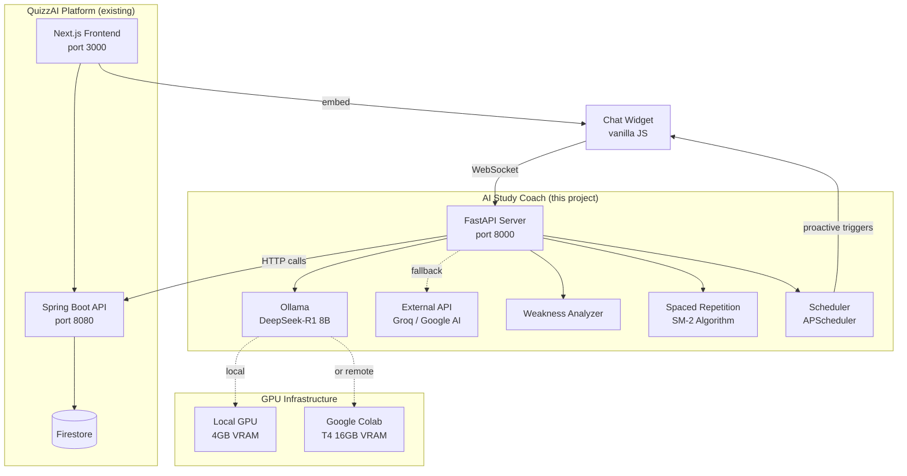
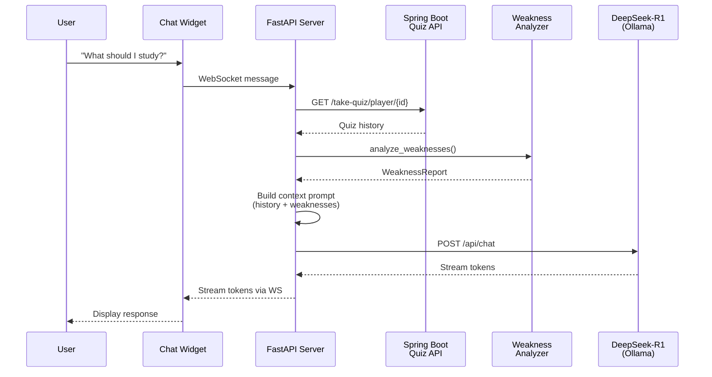
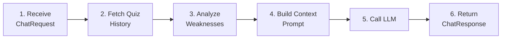

# AI Study Coach

An AI-powered study coaching microservice that connects to quiz/learning platforms and provides **personalized study guidance**. It implements real learning science — weakness detection, spaced repetition scheduling, and proactive study reminders — powered by a **self-hosted DeepSeek-R1 language model**.

Built as a standalone Python microservice using **FastAPI**, designed to integrate with any quiz application via REST API and WebSocket.

> **Graduation Thesis Project** — Demonstrates self-hosted LLM inference, domain-specific fine-tuning (QLoRA), and applied learning science algorithms.

---

## Table of Contents

- [Architecture](#architecture)
- [Key Features](#key-features)
- [Technology Stack](#technology-stack)
- [Project Structure](#project-structure)
- [Module Documentation](#module-documentation)
  - [Server Entry Point](#1-server-entry-point)
  - [Configuration](#2-configuration)
  - [Agent Core](#3-agent-core)
  - [LLM Clients](#4-llm-clients)
  - [Quiz API Client](#5-quiz-api-client)
  - [Learning Intelligence](#6-learning-intelligence)
  - [Routes & Endpoints](#7-routes--endpoints)
  - [Data Models](#8-data-models)
- [API Reference](#api-reference)
- [LLM & Model Strategy](#llm--model-strategy)
- [Google Colab Integration](#google-colab-integration)
- [Getting Started](#getting-started)
- [Environment Variables](#environment-variables)
- [Development Roadmap](#development-roadmap)

---

## Architecture



### Data Flow



---

## Key Features

| Feature | Description | Implementation |
|---------|-------------|----------------|
| **Weakness Detection** | Aggregates wrong answers by category, tracks accuracy trends | Algorithmic — `learning/weakness.py` |
| **Spaced Repetition** | SM-2 algorithm schedules review quizzes at optimal intervals | Algorithmic — `learning/spaced_repetition.py` |
| **Proactive Nudges** | "You haven't studied Math in 5 days" style reminders | APScheduler — `scheduler/proactive.py` |
| **Post-Quiz Coaching** | Auto-triggers after quiz completion with mistake analysis | Webhook — `routes/triggers.py` |
| **Real-time Streaming** | Token-by-token response streaming via WebSocket | FastAPI WebSocket — `routes/chat.py` |
| **Self-Hosted LLM** | DeepSeek-R1-Distill-Llama-8B via Ollama (no third-party API) | Ollama — `llm/ollama.py` |
| **Fine-Tuned Model** | QLoRA fine-tuning on study coaching conversations | Colab notebook — `colab/colab_finetune.py` |
| **LLM Fallback** | Automatic fallback to external APIs if Ollama is down | `llm/external.py` |

### What Makes This Different from a Generic Chatbot

| Capability | Generic AI Chatbot | AI Study Coach ✅ |
|---|---|---|
| Weakness detection | ❌ | Aggregates wrong answers by category, tracks trends |
| Spaced repetition | ❌ | SM-2 algorithm schedules review quizzes |
| Proactive nudges | ❌ | "You haven't studied Math in 5 days" |
| Post-quiz coaching | ❌ | Auto-triggers: explains mistakes, suggests next steps |
| Adaptive difficulty | ❌ | Recommends harder/easier quizzes based on performance |
| Self-hosted LLM | Sometimes | DeepSeek-R1 8B — privacy-first, no data leaves your infra |

---

## Technology Stack

### Core Server

| Technology | Version | Purpose |
|---|---|---|
| **Python** | 3.12+ | Runtime |
| **FastAPI** | 0.115.12 | Web framework (async, WebSocket support) |
| **Uvicorn** | 0.34.2 | ASGI server |
| **Pydantic** | 2.11.1 | Data validation, schemas, settings |
| **HTTPX** | 0.28.1 | Async HTTP client (for Quiz API + Ollama) |
| **APScheduler** | 3.11.0 | Background job scheduler (proactive nudges) |
| **aiosqlite** | 0.21.0 | Async SQLite (spaced repetition schedules) |
| **WebSockets** | 15.0.1 | Real-time chat streaming |

### AI / LLM

| Technology | Purpose |
|---|---|
| **Ollama** | Self-hosted LLM inference server |
| **DeepSeek-R1-Distill-Llama-8B** | Primary language model (8B params, reasoning-capable) |
| **Unsloth** | 2× faster fine-tuning with 60% less VRAM |
| **QLoRA (4-bit)** | Memory-efficient fine-tuning via Low-Rank Adaptation |
| **GGUF** | Quantized model format for efficient inference |
| **ngrok** | Tunnel to expose Colab-hosted Ollama to local server |

### External Platform

| Technology | Purpose |
|---|---|
| **Spring Boot** (Java) | Quiz platform backend (existing) |
| **Next.js** (React) | Quiz platform frontend (existing) |
| **Firestore** | Quiz platform database (existing) |

---

## Project Structure

```
ai-study-coach/
├── server/                              # FastAPI microservice
│   ├── main.py                          # App entry point, lifespan, CORS
│   ├── config.py                        # Settings via pydantic-settings
│   ├── __init__.py
│   │
│   ├── agent/                           # AI agent orchestration
│   │   ├── coach.py                     # Main agent loop
│   │   ├── prompts.py                   # System prompts & template builders
│   │   └── __init__.py
│   │
│   ├── llm/                             # Language model clients
│   │   ├── ollama.py                    # Local/remote Ollama client
│   │   ├── external.py                  # Groq / Google AI fallback
│   │   └── __init__.py
│   │
│   ├── learning/                        # Learning science algorithms
│   │   ├── weakness.py                  # Weakness analysis engine
│   │   ├── spaced_repetition.py         # SM-2 algorithm (planned)
│   │   ├── progress.py                  # Score trend tracking (planned)
│   │   └── __init__.py
│   │
│   ├── quiz_client/                     # External API integration
│   │   ├── client.py                    # HTTP client for Spring Boot API
│   │   └── __init__.py
│   │
│   ├── models/                          # Data models
│   │   ├── schemas.py                   # Pydantic models (request/response)
│   │   └── __init__.py
│   │
│   ├── routes/                          # API endpoints
│   │   ├── chat.py                      # POST /chat + WS /ws/chat
│   │   ├── health.py                    # GET /health
│   │   └── __init__.py
│   │
│   └── scheduler/                       # Background jobs (planned)
│       └── __init__.py
│
├── colab/                               # Google Colab notebooks
│   ├── colab_ollama_server.py           # Run DeepSeek-R1 on Colab GPU
│   ├── colab_finetune.py               # Fine-tune with QLoRA
│   ├── README_COLAB.md                  # Colab setup guide
│   └── training_data/
│       └── study_coach_data.json        # Training data for fine-tuning
│
├── .env                                 # Environment variables (gitignored)
├── .env.example                         # Environment template
├── requirements.txt                     # Python dependencies
└── implementation_plan.md               # Full project plan & roadmap
```

---

## Module Documentation

### 1. Server Entry Point

**File:** `server/main.py`

The FastAPI application entry point. Responsibilities:

- **Application factory** — Creates the FastAPI app with metadata, CORS, and routing
- **Lifespan management** — Startup/shutdown events with logging
- **Ollama health check** — On startup, pings the configured Ollama URL and reports:
  - Whether the connection is **local** or **remote via ngrok** (Google Colab)
  - Which models are currently available
  - A helpful hint if the remote Ollama is unreachable
- **CORS configuration** — Allows the quiz app frontend to make cross-origin requests
- **Router registration** — Mounts chat and health route modules

```python
# Startup log output example:
# 🚀 AI Study Coach starting...
#    Quiz API: http://localhost:8080
#    Ollama:   https://xxxx.ngrok-free.app (model: deepseek-r1:8b)
#    ✅ Ollama connected (remote via ngrok) — models: deepseek-r1:8b
```

---

### 2. Configuration

**File:** `server/config.py`

Uses **pydantic-settings** for type-safe configuration via environment variables. All variables are prefixed with `COACH_` and loaded from `.env`.

| Setting | Env Variable | Default | Description |
|---|---|---|---|
| `quiz_api_url` | `COACH_QUIZ_API_URL` | `http://localhost:8080` | Spring Boot quiz API base URL |
| `ollama_url` | `COACH_OLLAMA_URL` | `http://localhost:11434` | Ollama server URL (local or ngrok) |
| `ollama_model` | `COACH_OLLAMA_MODEL` | `phi3:mini` | Model name in Ollama |
| `ollama_timeout` | `COACH_OLLAMA_TIMEOUT` | `120` | Request timeout in seconds |
| `external_llm_provider` | `COACH_EXTERNAL_LLM_PROVIDER` | `groq` | `groq` or `google` |
| `external_llm_api_key` | `COACH_EXTERNAL_LLM_API_KEY` | `""` | API key for external provider |
| `external_llm_model` | `COACH_EXTERNAL_LLM_MODEL` | `llama-3.1-8b-instant` | External model name |
| `database_url` | `COACH_DATABASE_URL` | `sqlite+aiosqlite:///./study_coach.db` | Database connection string |
| `cors_origins` | `COACH_CORS_ORIGINS` | `["http://localhost:3000", ...]` | Allowed CORS origins |

---

### 3. Agent Core

#### 3.1 Coach Agent — `server/agent/coach.py`

The **main orchestrator** of the AI Study Coach. Implements a 6-step pipeline:



**Key functions:**

| Function | Description |
|---|---|
| `handle_chat(request)` | Main entry point — runs the full pipeline |
| `_get_llm_response(messages, use_external)` | LLM routing with fallback chain |
| `_is_complex_request(message)` | Heuristic to route complex queries to external LLM |

**LLM Routing Logic:**

```
1. If request is "complex" AND external LLM is configured → use external
2. Else if Ollama is available → use Ollama
3. Else if external LLM is configured → fallback to external
4. Else → raise RuntimeError (no LLM available)
```

"Complex" requests are detected by keyword matching: `study plan`, `weekly plan`, `schedule`, `detailed`, `explain`, `in depth`, `comprehensive`, `long term`.

#### 3.2 Prompts — `server/agent/prompts.py`

Manages the **system prompt** and **context construction** for the LLM.

**System Prompt** defines the AI's personality:
- Friendly, supportive study coach
- Uses structured formatting (bullet points, headers)
- References specific quiz data — never gives generic advice
- Uses emoji sparingly

**Context Builder** (`build_context_prompt`) constructs a data-rich context message from:

| Data Source | Example Output |
|---|---|
| Quiz History | `- **Geography Quiz**: Score 3/5 (on 2026-03-28)` |
| Weakness Analysis | `- Weakest categories: GEOGRAPHY, HISTORY` |
| Accuracy Bars | `- MATH: 🟩🟩🟩🟩🟩🟩🟩🟩⬜⬜ 85%` |
| Declining Trends | `- ⚠️ Declining categories: HISTORY` |
| Due Reviews | `- **Geography Quiz** (GEOGRAPHY) — due 2026-04-01` |

**Message Builder** (`build_messages`) assembles the full message list:

```
[system prompt] → [context data] → [conversation history] → [user message]
```

---

### 4. LLM Clients

#### 4.1 Ollama Client — `server/llm/ollama.py`

HTTP client for the **Ollama inference server** (local or remote via Google Colab + ngrok).

| Method | Description | Returns |
|---|---|---|
| `chat(messages, temperature)` | Full response (blocking) | `str` |
| `chat_stream(messages, temperature)` | Token-by-token streaming | `AsyncGenerator[str]` |
| `is_available()` | Ping `/api/tags` endpoint | `bool` |

**Protocol:** Communicates via Ollama's REST API at `/api/chat`. Supports both streaming (`stream: True`) and non-streaming modes.

**Configuration:** URL and model are configurable via environment variables, meaning the same client works for:
- Local Ollama: `http://localhost:11434`
- Remote Colab via ngrok: `https://xxxx.ngrok-free.app`

#### 4.2 External LLM Client — `server/llm/external.py`

Fallback client using the **OpenAI-compatible API format**. Supports two providers:

| Provider | Base URL | Default Model |
|---|---|---|
| **Groq** | `api.groq.com/openai/v1/chat/completions` | `llama-3.1-8b-instant` |
| **Google AI** | `generativelanguage.googleapis.com/v1beta/openai/...` | `gemini-2.0-flash` |

Same interface as OllamaClient (`chat`, `chat_stream`, `is_available`). Availability is determined by whether an API key is configured.

---

### 5. Quiz API Client

**File:** `server/quiz_client/client.py`

HTTP client wrapping the **Spring Boot quiz platform API**. Fetches student data for the AI coach to analyze.

| Method | API Endpoint | Returns |
|---|---|---|
| `get_player_history(player_id)` | `GET /take-quiz/player/{id}` | `list[TakeQuizResponse]` |
| `get_quiz_details(quiz_id)` | `GET /quiz/{id}` | `QuizResponse` |
| `get_questions(quiz_id)` | `GET /question/quizId/{id}` | `list[QuestionResponse]` |
| `get_quiz_profile(user_id)` | `GET /user/quiz-profile?userId=` | `UserQuizProfile` |

All methods handle `404` gracefully (return empty list or `None`). Uses a singleton pattern (`quiz_client`) for connection reuse.

---

### 6. Learning Intelligence

#### 6.1 Weakness Analyzer — `server/learning/weakness.py`

**Algorithmic analysis** (no AI needed) — fast and reliable.

**Algorithm:**

```
1. For each quiz attempt in history:
   a. Fetch the quiz to get its categories
   b. Parse the score string (e.g., "3/5" → correct=3, total=5)
   c. Group scores by category

2. Calculate accuracy per category:
   accuracy = total_correct / total_questions

3. Find weakest categories:
   categories where accuracy < 60%

4. Detect declining trends:
   if last 2 attempts have 10%+ lower accuracy than previous 2
   → mark category as "declining"
```

**Output:** `WeaknessReport`

```python
WeaknessReport(
    weakest_categories=["GEOGRAPHY", "HISTORY"],
    accuracy_by_category={"MATH": 0.85, "GEOGRAPHY": 0.30, "HISTORY": 0.45},
    declining=["HISTORY"],  # Was 60%, now 40%
)
```

#### 6.2 Spaced Repetition — `server/learning/spaced_repetition.py` *(Planned)*

Implementation of the **SM-2 algorithm** (same algorithm used by Anki):

```
After a quiz:
  Score ≥ 80%: next_review = interval × 2.5 days
  Score 60-79%: next_review = interval × 1.5 days
  Score < 60%: next_review = tomorrow

Stored in SQLite: {user_id, quiz_id, category, next_review_date, interval, ease_factor}
```

#### 6.3 Progress Tracker — `server/learning/progress.py` *(Planned)*

- Score trends by category over time
- Study streaks (consecutive days)
- Weekly/monthly quiz completion counts

---

### 7. Routes & Endpoints

#### 7.1 Chat — `server/routes/chat.py`

Two communication modes:

**HTTP Chat** (`POST /chat`)
- Simple request/response for non-streaming clients
- Uses `handle_chat()` from the agent core
- Returns full response at once

**WebSocket Chat** (`WS /ws/chat`)
- Real-time token-by-token streaming
- Persistent connection per session
- Protocol:

```
Client → Server:
  {"user_id": "abc123", "message": "What should I study?", "history": [...]}

Server → Client (per token):
  {"type": "token", "content": "Let"}
  {"type": "token", "content": "'s"}
  {"type": "token", "content": " look"}
  ...

Server → Client (completion):
  {"type": "done", "weaknesses": ["GEOGRAPHY", "HISTORY"]}

Server → Client (error):
  {"type": "error", "content": "No LLM available."}
```

#### 7.2 Health — `server/routes/health.py`

Health check endpoint that reports the status of all LLM backends:

```
GET /health

Response:
{
  "status": "ok",           // "ok" if any LLM available, "degraded" if none
  "ollama": "connected",    // or "unavailable"
  "external_llm": "configured"  // or "not configured"
}
```

---

### 8. Data Models

**File:** `server/models/schemas.py`

All models use **Pydantic v2** for validation and serialization.

#### Chat Models

| Model | Fields | Purpose |
|---|---|---|
| `ChatRole` | `USER`, `ASSISTANT`, `SYSTEM` | Enum for message roles |
| `ChatMessage` | `role`, `content` | Single chat message |
| `ChatRequest` | `user_id`, `message`, `history[]` | Incoming chat request |
| `ChatResponse` | `role`, `content`, `weaknesses[]`, `due_reviews[]` | Outgoing chat response |

#### Quiz API Response Models

| Model | Fields | Purpose |
|---|---|---|
| `QuizResponse` | `id`, `hostId`, `title`, `description`, `status`, `categories[]` | Quiz metadata |
| `TakeQuizResponse` | `quizId`, `quizTitle`, `score`, `status`, `updatedAt` | Quiz attempt result |
| `QuestionResponse` | `id`, `quizId`, `content`, `answers[]`, `correctAnswer` | Individual question |
| `UserQuizProfile` | `quizzesCreated[]`, `quizzesTaken[]` | User's quiz overview |

#### Analysis Models

| Model | Fields | Purpose |
|---|---|---|
| `WeaknessReport` | `weakest_categories[]`, `accuracy_by_category{}`, `declining[]` | Weakness analysis output |
| `ReviewSchedule` | `quiz_id`, `quiz_title`, `category`, `next_review`, `interval_days`, `ease_factor` | SM-2 schedule entry |
| `QuizCompletedWebhook` | `player_id`, `quiz_id`, `take_id`, `score` | Webhook payload |

---

## API Reference

### Endpoints Summary

| Method | Endpoint | Description | Auth |
|---|---|---|---|
| `GET` | `/` | Service info | None |
| `GET` | `/health` | Health check + LLM status | None |
| `GET` | `/docs` | Swagger UI (auto-generated) | None |
| `POST` | `/chat` | Send message, get full response | None |
| `WS` | `/ws/chat` | Real-time streaming chat | None |

### `POST /chat`

**Request:**

```json
{
    "user_id": "player_abc123",
    "message": "What are my weakest subjects?",
    "history": [
        {"role": "user", "content": "Hi"},
        {"role": "assistant", "content": "Hello! How can I help?"}
    ]
}
```

**Response:**

```json
{
    "role": "assistant",
    "content": "Based on your quiz history, your weakest areas are...",
    "weaknesses": ["GEOGRAPHY", "HISTORY"],
    "due_reviews": null
}
```

### `WS /ws/chat`

Connect via WebSocket. Send JSON messages, receive streamed tokens. See [Routes documentation](#71-chat--serverrouteschatpy) for the full protocol.

---

## LLM & Model Strategy

### Model: DeepSeek-R1-Distill-Llama-8B

| Property | Value |
|---|---|
| **Model** | `deepseek-ai/DeepSeek-R1-Distill-Llama-8B` |
| **Ollama Tag** | `deepseek-r1:8b` |
| **Parameters** | 8 billion |
| **Architecture** | Llama-based, distilled from DeepSeek-R1 |
| **Strength** | Strong reasoning capabilities |
| **VRAM Required** | ~8 GB (quantized) |
| **Hosting** | Google Colab T4 GPU (16 GB VRAM) |

### Why DeepSeek-R1?

1. **Reasoning capability** — Distilled from DeepSeek-R1, which excels at structured reasoning tasks (study plans, analysis)
2. **Right size** — 8B parameters fits comfortably on a T4 GPU
3. **Open weights** — Fully open-source, suitable for fine-tuning
4. **Academic credibility** — Well-cited model from a major research lab

### Task Distribution

| Task | Implementation | Why |
|---|---|---|
| Chat responses, study plans | **DeepSeek-R1 8B** (Ollama) | Needs natural language generation |
| Weakness analysis | **Algorithmic** (Python) | Deterministic, fast, reliable |
| SM-2 scheduling | **Algorithmic** (Python) | Mathematical formula, no AI needed |
| Progress tracking | **Algorithmic** (Python) | Simple aggregation |

> **Design principle:** Use AI only where natural language understanding/generation is needed. Everything else is algorithmic — faster, more reliable, and easier to test.

### Fine-Tuning (QLoRA)

The model can be fine-tuned on study coaching conversations using **QLoRA** (Quantized Low-Rank Adaptation):

| Parameter | Value |
|---|---|
| Quantization | 4-bit (QLoRA) |
| LoRA Rank | r = 16 |
| Target Modules | q_proj, k_proj, v_proj, o_proj, gate_proj, up_proj, down_proj |
| Training Epochs | 3 |
| Batch Size | 2 (gradient accumulation: 4) |
| Learning Rate | 2e-4 |
| Export Format | GGUF (Q4_K_M) |
| Custom Model Name | `study-coach` |

See `colab/README_COLAB.md` for the full fine-tuning guide.

---

## Google Colab Integration

Since the development laptop has only **4 GB VRAM**, the LLM runs on **Google Colab's T4 GPU** (16 GB VRAM) and is exposed via **ngrok** tunnel.

```
┌───────────────────────┐            ┌──────────────────────────────┐
│  Laptop               │            │  Google Colab (T4 GPU)       │
│                       │   HTTPS    │                              │
│  FastAPI Server ──────┼───────────►│  Ollama Server               │
│  (port 8000)          │   ngrok    │  DeepSeek-R1 8B              │
│                       │   tunnel   │  or: study-coach (fine-tuned) │
└───────────────────────┘            └──────────────────────────────┘
```

### Colab Notebooks

| File | Purpose |
|---|---|
| `colab/colab_ollama_server.py` | **Inference** — Run DeepSeek-R1 on Colab, expose via ngrok |
| `colab/colab_finetune.py` | **Fine-tuning** — QLoRA fine-tuning + GGUF export + Ollama model |
| `colab/training_data/study_coach_data.json` | Sample training data (5 examples) |
| `colab/README_COLAB.md` | Complete setup guide |

### Quick Start (Inference Only)

1. Open Google Colab → New notebook → Set runtime to **T4 GPU**
2. Copy cells from `colab/colab_ollama_server.py` → Run in order
3. Copy the ngrok URL from the output
4. Update `.env`:
   ```env
   COACH_OLLAMA_URL=https://xxxx.ngrok-free.app
   COACH_OLLAMA_MODEL=deepseek-r1:8b
   ```
5. Start the local FastAPI server

### Fine-Tuning

1. Add training examples to `colab/training_data/study_coach_data.json` (50-200 recommended)
2. Copy cells from `colab/colab_finetune.py` into a new Colab notebook
3. Run all cells (~30-45 min total)
4. Update `.env` with the ngrok URL and model name `study-coach`

See `colab/README_COLAB.md` for detailed instructions.

---

## Getting Started

### Prerequisites

- **Python 3.12+**
- **Ollama** installed ([ollama.com](https://ollama.com)) — or use Google Colab
- **ngrok** account ([ngrok.com](https://ngrok.com)) — if using Colab
- **Spring Boot quiz app** running on port 8080 (optional — coach works without it)

### Installation

```bash
# 1. Clone the repository
git clone <your-repo-url>
cd ai-study-coach

# 2. Create virtual environment
python -m venv venv

# Windows
venv\Scripts\activate

# macOS/Linux
source venv/bin/activate

# 3. Install dependencies
pip install -r requirements.txt

# 4. Configure environment
copy .env.example .env
# Edit .env with your settings
```

### Running the Server

```bash
# Start the FastAPI server
python -m uvicorn server.main:app --reload --host 0.0.0.0 --port 8000
```

The server will start and show:

```
🚀 AI Study Coach starting...
   Quiz API: http://localhost:8080
   Ollama:   http://localhost:11434 (model: deepseek-r1:8b)
   ✅ Ollama connected (local) — models: deepseek-r1:8b
```

### Testing

```bash
# Health check
curl http://localhost:8000/health

# Chat (HTTP)
curl -X POST http://localhost:8000/chat \
  -H "Content-Type: application/json" \
  -d '{"user_id": "test_user", "message": "What should I study?"}'

# Swagger UI
open http://localhost:8000/docs
```

---

## Environment Variables

Copy `.env.example` to `.env` and configure:

```env
# Quiz App API (Spring Boot backend)
COACH_QUIZ_API_URL=http://localhost:8080

# Ollama (local or remote via Google Colab)
COACH_OLLAMA_URL=http://localhost:11434
# For Colab: COACH_OLLAMA_URL=https://xxxx.ngrok-free.app
COACH_OLLAMA_MODEL=deepseek-r1:8b
# After fine-tuning: COACH_OLLAMA_MODEL=study-coach

# External LLM fallback (optional)
COACH_EXTERNAL_LLM_PROVIDER=groq
COACH_EXTERNAL_LLM_API_KEY=
COACH_EXTERNAL_LLM_MODEL=llama-3.1-8b-instant

# CORS
COACH_CORS_ORIGINS=["http://localhost:3000"]
```

---

## Development Roadmap

### Phase 1: Core Agent Server ✅

- [x] FastAPI project setup with Uvicorn
- [x] Ollama client (local + remote via ngrok)
- [x] External LLM client (Groq / Google AI fallback)
- [x] Quiz API client (Spring Boot integration)
- [x] Agent core with context-aware prompt building
- [x] HTTP chat endpoint (`POST /chat`)
- [x] WebSocket chat endpoint (`WS /ws/chat`)
- [x] Health check endpoint
- [x] Pydantic schemas for all data models
- [x] Google Colab integration (inference + fine-tuning)

### Phase 2: Learning Intelligence 🔧

- [x] Weakness analyzer (algorithmic)
- [ ] SM-2 spaced repetition scheduler
- [ ] Progress tracker (score trends, streaks)
- [ ] SQLite storage for schedules

### Phase 3: Proactive Features + Widget 📋

- [ ] APScheduler proactive triggers
- [ ] Post-quiz coaching webhook
- [ ] Inactivity nudges
- [ ] Weekly digest
- [ ] Embeddable chat widget (vanilla JS)
- [ ] Widget notification badge

### Phase 4: Polish & Graduation 📋

- [ ] Architecture diagrams
- [ ] SM-2 algorithm documentation
- [ ] Evaluation: before/after quiz scores
- [ ] Comparison vs Duolingo, Anki, Khan Academy
- [ ] Demo with seed data
- [ ] Fine-tuned model evaluation

---

## License

This project is part of a graduation thesis. Contact the author for license information.
