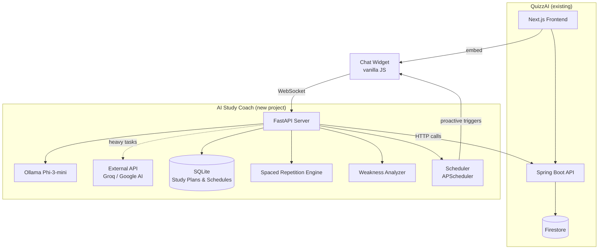

# AI Study Coach — Standalone Microservice

## Overview

A **standalone Python microservice** that connects to any quiz/learning platform and acts as an intelligent study coach. It implements **real learning science** (spaced repetition, weakness detection) and is **proactive** (initiates study reminders, post-quiz analysis).

Your quiz app (Spring Boot + Next.js) is the first client.



---

## What Makes This Different

| Feature | Generic AI Chatbot | This Project ✅ |
|---|---|---|
| Weakness detection | ❌ | Aggregates wrong answers by category, tracks trends |
| Spaced repetition | ❌ | SM-2 algorithm schedules review quizzes |
| Proactive nudges | ❌ | "You haven't studied Math in 5 days" |
| Post-quiz coaching | ❌ | Auto-triggers after quiz: explains mistakes, suggests next steps |
| Adaptive difficulty | ❌ | Recommends harder/easier quizzes based on performance |
| Self-hosted LLM | Sometimes | Phi-3-mini on RTX 3050 (4GB) for privacy |

---

## Project Structure

```
ai-study-coach/
├── server/
│   ├── main.py                     # FastAPI entry point
│   ├── config.py                   # Settings (Ollama URL, quiz API URL)
│   ├── agent/
│   │   ├── coach.py                # Main agent loop — orchestrates everything
│   │   ├── prompts.py              # System prompts & templates
│   │   └── tools.py                # Tool definitions the LLM can call
│   ├── llm/
│   │   ├── ollama.py               # Local LLM client
│   │   └── external.py             # Groq/Google AI fallback
│   ├── learning/
│   │   ├── weakness.py             # Weakness analysis engine
│   │   ├── spaced_repetition.py    # SM-2 algorithm implementation
│   │   └── progress.py             # Score trend tracking
│   ├── quiz_client/
│   │   └── client.py               # HTTP client for quiz API
│   ├── scheduler/
│   │   └── proactive.py            # APScheduler: review reminders, nudges
│   ├── models/
│   │   └── schemas.py              # Pydantic models
│   └── routes/
│       ├── chat.py                 # WebSocket /ws/chat
│       ├── triggers.py             # POST /trigger/post-quiz
│       └── health.py               # GET /health
├── widget/
│   ├── agent-widget.js             # Embeddable chat widget (vanilla JS)
│   └── agent-widget.css            # Widget styles
├── requirements.txt
├── Dockerfile
└── README.md
```

---

## Phase 1: Core Agent Server (Weeks 1-3)

### 1.1 Project Setup
- FastAPI project with `uvicorn`
- Ollama client (HTTP to `localhost:11434/api/chat`)
- External LLM client (Groq or Google AI Studio — free tier)
- Config via environment variables

### 1.2 Quiz API Client (`quiz_client/client.py`)
Wraps your Spring Boot endpoints:

| Method | Quiz API Endpoint | Purpose |
|---|---|---|
| `get_player_history(player_id)` | `GET /take-quiz/player/{id}` | All quiz attempts + scores |
| `get_quiz_details(quiz_id)` | `GET /quiz/{id}` | Quiz title, categories |
| `get_questions(quiz_id)` | `GET /question/quizId/{id}` | Questions + correct answers |
| `get_quiz_profile(user_id)` | `GET /user/quiz-profile?userId=` | Created + taken quizzes |

### 1.3 Agent Core (`agent/coach.py`)

The agent loop using **tool-calling pattern**:

```python
# Simplified flow
async def handle_message(user_msg, user_id):
    # 1. Build context: fetch quiz history from quiz API
    history = await quiz_client.get_player_history(user_id)
    
    # 2. Run algorithmic analysis (no LLM needed)
    weaknesses = weakness_analyzer.analyze(history)
    schedule = spaced_rep.get_due_reviews(user_id)
    
    # 3. Build prompt with structured data
    prompt = build_prompt(user_msg, history, weaknesses, schedule)
    
    # 4. Call LLM (local or external based on complexity)
    response = await llm.chat(prompt)
    
    return response
```

### 1.4 Chat Endpoint
- **WebSocket** at `/ws/chat` for real-time streaming
- Session-scoped (fresh each page reload, no persistence)
- User ID passed from frontend widget

---

## Phase 2: Learning Intelligence (Weeks 3-5)

### 2.1 Weakness Analyzer (`learning/weakness.py`)

**Algorithmic, not AI** — reliable and fast:

```python
def analyze(history: list[QuizAttempt]) -> WeaknessReport:
    # Group wrong answers by category
    # Calculate accuracy % per category
    # Detect declining trends (last 3 attempts getting worse)
    # Rank categories from weakest to strongest
    return WeaknessReport(
        weakest_categories=["GEOGRAPHY", "HISTORY"],
        accuracy_by_category={"MATH": 0.85, "GEOGRAPHY": 0.30},
        declining=["HISTORY"],  # was 60%, now 40%
    )
```

### 2.2 Spaced Repetition (`learning/spaced_repetition.py`)

Implement the **SM-2 algorithm** (same as Anki):

```
When a user finishes a quiz:
  - Score ≥ 80%: schedule next review in (interval × 2.5) days
  - Score 60-79%: schedule review in (interval × 1.5) days  
  - Score < 60%: schedule review tomorrow

Store schedule in SQLite: {user_id, quiz_id, category, next_review_date, interval, ease_factor}
```

> [!IMPORTANT]
> This is the **key differentiator** for your graduation. SM-2 is a well-documented algorithm with academic backing — perfect for a thesis.

### 2.3 Progress Tracker (`learning/progress.py`)
- Score trends by category over time
- Streaks (consecutive days of study)
- Total quizzes taken this week/month

---

## Phase 3: Proactive Features + Widget (Weeks 5-7)

### 3.1 Proactive Triggers (`scheduler/proactive.py`)

Uses APScheduler to run background checks:

| Trigger | Condition | Message |
|---|---|---|
| **Post-quiz coaching** | User finishes a quiz | "You scored 2/5 on History. Here's what to focus on..." |
| **Review reminder** | SM-2 says quiz is due | "Time to review your Geography quiz! Last score: 3/5" |
| **Inactivity nudge** | No quiz in 3+ days | "You're on a streak! Don't break it — try a quick Science quiz" |
| **Weekly digest** | Every Sunday | "This week: Math ↑20%, Geography ↓10%. Focus on..." |

### 3.2 Integration with Quiz App

Add one endpoint to the Spring Boot backend:

#### [NEW] Webhook endpoint in Spring Boot
```
POST /webhook/quiz-completed
Body: { "playerId": "...", "quizId": "...", "takeId": "...", "score": "3/5" }
```
Called after `TakeQuizService.EndQuiz()` — notifies the study coach that a quiz was completed. This triggers post-quiz coaching.

### 3.3 Embeddable Widget (`widget/agent-widget.js`)

```html
<!-- Add to quiz app's _app.js (or any website) -->
<script 
  src="http://localhost:8000/static/agent-widget.js"
  data-ws-url="ws://localhost:8000/ws/chat"
  data-user-id="{{userId}}"
  data-theme="dark">
</script>
```

Features:
- Floating bubble (bottom-right), expandable chat window
- WebSocket connection for real-time streaming
- Notification badge for proactive messages
- Markdown rendering for study plans
- Dark/light theme
- Mobile responsive

---

## Phase 4: Polish & Graduation (Weeks 7-10)

### 4.1 Graduation Documentation Checklist
- [ ] Architecture diagram (the mermaid diagram above, expanded)
- [ ] API documentation (FastAPI auto-generates Swagger)  
- [ ] SM-2 algorithm explanation with math formulas
- [ ] Screenshots of chat widget in action
- [ ] Evaluation: before/after quiz scores with study plans
- [ ] Comparison table vs Duolingo, Anki, Khan Academy

### 4.2 Demo Preparation
- Seed data: 10+ quiz attempts showing a clear "weak in Geography, strong in Math" pattern
- Live demo flow: take quiz → get coaching → follow plan → retake → show improvement
- Show the proactive notification appearing after quiz completion

### 4.3 Bonus (if time permits)
- [ ] AI-generated review quizzes targeting weak categories
- [ ] Knowledge graph: show how topics connect
- [ ] Second client demo (prove reusability)

---

## Model Strategy (4GB VRAM)

| Task | Model | Where |
|---|---|---|
| Chat responses, API routing | **Phi-3-mini 3.8B Q4** | Local Ollama |
| Complex study plans, explanations | **Gemini Flash** or **Llama 3 via Groq** | External API (free) |
| Weakness analysis, SM-2, progress | **No AI needed** | Algorithmic (Python) |

> [!TIP]
> The learning intelligence (weakness analysis, spaced repetition, progress tracking) is all **algorithmic** — fast, reliable, and doesn't need the LLM. The LLM is only for natural language conversation and generating human-readable study plans from the structured data.

---

## New Endpoints Summary

### Study Coach Microservice (FastAPI)

| Endpoint | Type | Description |
|---|---|---|
| `/ws/chat` | WebSocket | Real-time chat with the study coach |
| `/trigger/post-quiz` | POST | Webhook: quiz completed → trigger coaching |
| `/api/study-plan/{userId}` | GET | Get current study plan |
| `/api/weaknesses/{userId}` | GET | Get weakness report |
| `/api/schedule/{userId}` | GET | Get spaced repetition schedule |
| `/health` | GET | Health check |

### Quiz App Changes (Spring Boot)

| Change | File | Description |
|---|---|---|
| Add webhook call | [TakeQuizService.java](file:///c:/codespace/quiz-ai-online/spring-backend/src/main/java/com/myproject/quizzai/service/TakeQuizService.java) | After [EndQuiz()](file:///c:/codespace/quiz-ai-online/spring-backend/src/main/java/com/myproject/quizzai/controller/TakeQuizController.java#39-50), POST to study coach |
| Add CORS config | [AppConfig.java](file:///c:/codespace/quiz-ai-online/spring-backend/src/main/java/com/myproject/quizzai/config/AppConfig.java) | Allow study coach to call quiz API |

---

## Verification Plan

### Automated
- `pytest` for weakness analyzer (mock quiz data → verify category ranking)
- `pytest` for SM-2 scheduler (verify intervals after various scores)
- Integration test: mock quiz API → verify agent response includes weakness data

### Manual
1. Start Ollama + study coach + quiz app (3 terminals)
2. Take 5+ quizzes, deliberately fail Geography
3. Chat: "What should I study?" → verify it recommends Geography
4. Verify review reminder appears after SM-2 interval
5. Verify post-quiz coaching triggers automatically
6. Test widget on different screen sizes
